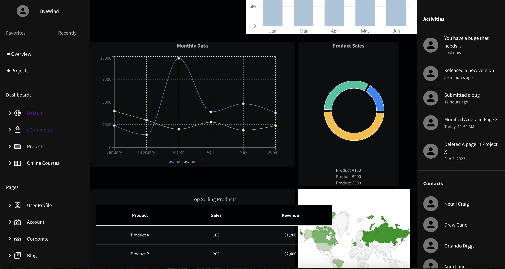

# React Dashboard Page  
[](https://aindriladutta25.github.io/ReactDashboard/)

Welcome to the **React Dashboard Page** repository! This project showcases a responsive and user-friendly dashboard interface built with modern web technologies and design principles.

---

## 🖥️ Live Demo  
Access the live version of the dashboard here:  
🔗 **[React Dashboard - GitHub Pages](https://aindriladutta25.github.io/ReactDasboard/)**

---

## 📸 Screenshots  

### Dashboard Overview  




### Order Management  


*(Add more screenshots if available)*

---

## 🚀 Features  
- **Responsive Design**: Optimized for desktop, tablet, and mobile devices.  
- **Figma Design Implementation**: Fully adheres to the provided Figma design.  
- **Reusable Components**: Modular architecture for scalable and maintainable code.  
- **Dynamic Charts and Analytics**: Built with libraries like `Recharts` and `ReactCharts` for interactive data visualization.  
- **Material UI Integration**: Clean and accessible UI components.  

---

## 🛠️ Technologies Used  

- **ReactJS**: Core framework for building the UI.  
- **Vite**: Modern build tool for fast and optimized development.  
- **Material UI (MUI)**: For accessible and customizable components.  
- **Recharts & ReactCharts**: Data visualization libraries.  
- **TailwindCSS**: Utility-first CSS framework for styling.  
- **JavaScript (ES6+)**: Logic and interactivity.  

---

## ⚙️ Installation & Setup  

Follow the steps below to set up the project locally:

### Prerequisites  
- **Node.js** (v16+ recommended)  
- **npm** or **yarn** package manager  

### Steps  

1. **Clone the repository**:  
   ```bash
   git clone https://github.com/aindriladutta25/ReactDashboard.git

2. **Install dependencies**:
    ```bash
    npm install

2. **Start the development server**:
    ```bash
    npm start

# Dashboard Page Design

This repository is for the development of a dashboard page. The goal is to create a clean, responsive, and user-friendly interface based on the provided requirements.

---

## Preview

Below is the planned design for the web page:  

  


# React + Vite

This template provides a minimal setup to get React working in Vite with HMR and some ESLint rules.

Currently, two official plugins are available:

- [@vitejs/plugin-react](https://github.com/vitejs/vite-plugin-react/blob/main/packages/plugin-react/README.md) uses [Babel](https://babeljs.io/) for Fast Refresh
- [@vitejs/plugin-react-swc](https://github.com/vitejs/vite-plugin-react-swc) uses [SWC](https://swc.rs/) for Fast Refresh

